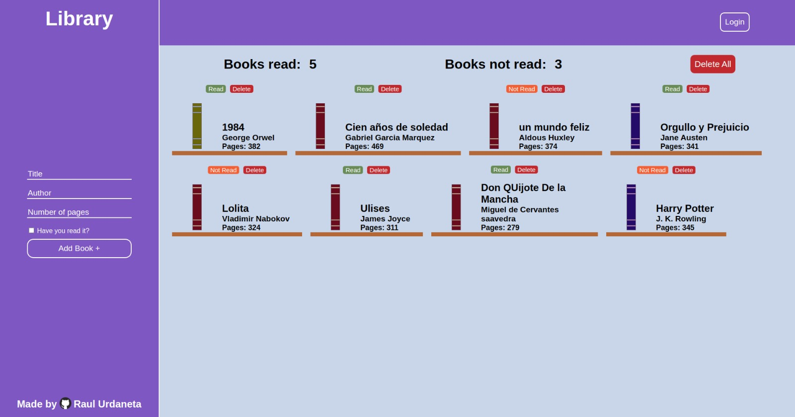

# library-project

# Learnings

- Used checkbox for the firs time.
- Used and manipulated objects and its info.
- Created different types of elements from Js using DOM.
- Learned another way to validate info from forms.
- Set up local storage for the first time.
- Created a function to save object info into the local storage.
- Created a function to retrieve the info in local storage.

[Live Preview](https://raulurdanetag.github.io/library-project/) 👈
